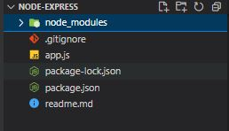
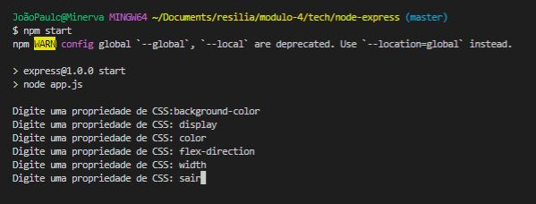
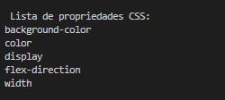

# Node Express

Projeto da primeira sprint do quarto módulo do curso de Web Dev. FullStack da Resilia, a proposta é a de criar uma aplicação que vai auxiliar desenvolvedores no dia a dia com CSS. A aplicação foi desenvolvida em Node, onde irá receber pelo terminal uma lista de propriedades do CSS e devolver essa lista ordenada de A-Z.
A organização do CSS dessa maneira nos ajuda a encontrar com mais facilidade e agilidade a propriedade que precisamos alterar.

## 🚀 Começando

Essas instruções permitirão que você obtenha uma cópia do projeto em operação na sua máquina local para fins de desenvolvimento e teste.

Consulte **Executando a aplicação** para saber como utilizar o projeto.

### 📋 Pré-requisitos

O que você precisa para instalar o software e como instalá-lo?

```
Node.js Versão 16.15.1 (Que no momento é a versão LTS)
Readline (Biblioteca utilizada no Node).
```

### 🔧 Instalação

Uma série de exemplos passo-a-passo que informam o que você deve executar para ter um ambiente de desenvolvimento em execução.

Instalação do Node:

```
Windows:
Você pode baixar direto pelo site: https://nodejs.org/en/

Ou então via Chocolatey:

choco install nodejs-lts

```
```
Mac:
Você pode baixar direto pelo site: https://nodejs.org/en/

```

```
Linux via apt e snap:
sudo apt-get install curl

curl -fsSL https://deb.nodesource.com/setup_lts.x | sudo -E bash -

sudo apt-get install -y nodejs

```

Após a instalação do Node utilizaremos os comandos do NPM (Node Package Manager) no terminal para instalar a biblioteca Readline:

```
npm i readline

```
Após a instalação você ele deve ter baixado uma pasta chamada node_modules conforme abaixo:
.

## ⚙️ Executando a aplicação

Para executar o teste você deve inserir o comando start do npm:

```
npm start

```
então irá aparecer no terminal a pergunta: "Digite uma propriedade de CSS:" , que irá receber o input, armazenar e organizar numa lista, quando terminar de colocar todos os input é só digitar SAIR ou sair para que ele pare de perguntar e imprima a lista.

Exemplo de como devem ser executados os comandos: 


Exemplo de como será impresso na tela do termminal os resultados:



## 🛠️ Construído com

Ferramentas utilizadas:

* [Readline](https://nodejs.org/api/readline.html#readline)
* [Node](https://nodejs.org/en/) - Gerente de Dependência

## ✒️ Autores

Projeto desenvolvido em conjunto pelo Squad 1:

* **Fernando Patrick** - *Code Review* - [umdesenvolvedor](https://github.com/FernandoPatrick)
* **Flávio Christovam** - *Documentação* - [fulanodetal](https://github.com/fchristovam)
* **João Paulo** - *Pair Programming* - [João Paulo](https://github.com/Joao-P-G-Begiato)
* **Lucas Passos** - *Programing* - [Lucas Passos](https://github.com/LucasBinho)
* **Rafael Jordão** - *Pair Programing* - [Rafael Jordão](https://github.com/rafaelljordao)

Você também pode ver a lista de todos os [colaboradores](https://github.com/usuario/projeto/colaboradores) que participaram deste projeto.

## 📄 Licença

Este projeto está sob a licença (sua licença) - veja o arquivo [LICENSE.md](https://github.com/Joao-P-G-Begiato/Node-express/blob/main/LICENSE) para detalhes.


## 🎁 Expressões de gratidão

* Primeiro a Leonardo Costa, nosso Facilitador Tech que nos engaja a sempre buscar novos conhecimentos e botá-los em prática.
* Em segundo mas não menos importante Anna Carolina Souza, nossa Facilitadora Soft que nos transforma na melhor versão de nós mesmo.
* A Resilia Educação que nos permite ser o protagonista da nossa própria história.
* e por fim a todos os colaboradores envolvidos com o projeto.


---
